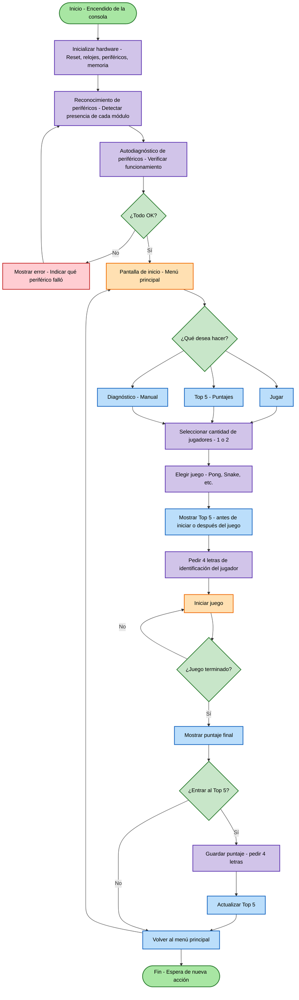
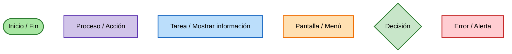

# Diagrama de Flujo – Consola Multijugador (Proyecto Digital 1)

## 1. Instrucciones del proyecto

**Objetivo:** Diseñar el diagrama de flujo de una consola multijugador para el Proyecto Digital 1, que incluya la verificación de periféricos, el menú principal, la selección de juegos y el sistema de puntajes (Top 5).

**Estructura del flujo a representar:**

1. Inicio (Encendido de la consola)
2. Inicializar hardware (Reset, relojes, periféricos, memoria)
3. Reconocimiento de periféricos (Detectar presencia de cada módulo)
4. Autodiagnóstico de periféricos (Verificar funcionamiento)
5. Decisión: ¿Todo OK?
   - **No** → Mostrar error (indicar qué periférico falló) → volver a reconocimiento
   - **Sí** → continuar
6. Pantalla de inicio (Menú principal)
7. Decisión: ¿Qué desea hacer?
   - Jugar
   - Top 5 (puntajes)
   - Diagnóstico (manual)
8. Seleccionar cantidad de jugadores (1 o 2)
9. Elegir juego (Pong, Snake, etc.)
10. Mostrar Top 5 (antes de iniciar o después del juego)
11. Pedir 4 letras de identificación (del jugador)
12. Iniciar juego
13. Decisión: ¿Juego terminado?
    - **No** → volver a Iniciar juego
    - **Sí** → continuar
14. Mostrar puntaje final
15. Decisión: ¿Entrar al Top 5?
    - **Sí** → Guardar puntaje (pedir 4 letras) → Actualizar Top 5
    - **No** → continuar
16. Volver al menú principal
17. Fin / Espera de nueva acción

**Periféricos a verificar:** Display (WS2812B), Controles (N64), Teclado (PS/2), Mouse (PS/2), Audio (I2S), I²C, Memoria (BRAM/SPI), Flash (SPI), UART.

**Simbología:**
- Verde (óvalo): Inicio / Fin
- Morado (rectángulo): Proceso / Acción
- Azul claro (rectángulo): Tarea / Mostrar información
- Naranja (rectángulo): Pantalla / Menú
- Verde claro (rombo): Decisión
- Rojo (rectángulo): Error / Alerta
- Flechas: Flujo

---

## 2. Diagrama de flujo – Consola Multijugador

---

## 3. Verificación de periféricos

| Periférico | Método de verificación (técnico) | Cómo se muestra (jugador / técnico) |
|-----------|----------------------------------|-------------------------------------|
| Display (WS2812B) | Patrón de colores + reproducción de imagen | Imagen en la matriz / LED de estado |
| Controles (N64) | Lectura de botones | Se ilumina un LED / respuesta en pantalla |
| Teclado (PS/2) | Recepción de código | Mensaje en pantalla / LED |
| Mouse (PS/2) | Movimiento y botones | Cursor en pantalla / LED |
| Audio (I2S) | Reproducción de un beep | Se escucha el sonido / LED |
| I²C | Transacción (START, ACK) | LED / mensaje OK |
| Memoria (BRAM/SPI) | Lectura y escritura | LED / mensaje OK |
| Flash (SPI) | Lectura de datos | LED / mensaje OK |
| UART | TX/RX (loopback o prueba) | Mensaje en pantalla / LED |

---

## 4. Ejemplo de flujo de diagnóstico (para el jugador)

1. Se muestra en cada pantalla un mensaje o ícono de "presione cualquier botón".
2. Al presionar, se reproduce un sonido (verifica audio + controles).
3. En la pantalla se muestra un patrón (verifica display).
4. Para teclado/mouse se muestra el código recibido o el movimiento en pantalla.
5. Se puede usar un LED en la placa como confirmación adicional (verifica que la lógica se ejecuta).
6. Si todo está OK, se muestra "Sistema listo" y se continúa.

---

## 5. Roles en la verificación

| Rol | Responsabilidades |
|-----|-------------------|
| **Diseñador** | Define el flujo general, decide qué se muestra en cada pantalla, planifica la interfaz de usuario |
| **Técnico de mantenimiento** | Verifica conectividad y señales, usa LEDs/indicadores físicos, revisa logs o mensajes de depuración |
| **Jugador** | Interactúa con la consola, comprueba que los controles y el audio respondan correctamente, consulta los menús y puntajes |

---

## 6. Simbología del diagrama

